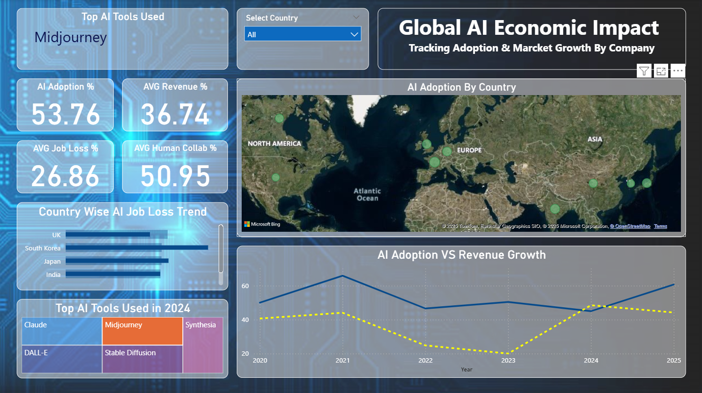

# 🌍 Global AI Economic Impact Dashboard — Power BI Case Study



## 📊 Project Overview

The **Global AI Economic Impact Dashboard** is a dynamic Power BI project designed to track, visualize, and analyze the worldwide impact of artificial intelligence on business, employment, and collaboration.

This dashboard offers a comprehensive view of AI adoption, revenue influence, job displacement, and human-AI collaboration across multiple countries. Built to assist **decision-makers, policymakers, and business leaders**, the dashboard provides actionable insights for shaping AI strategy and global innovation policy.

---

## 🚀 Key Insights Delivered

- 🤖 **AI Adoption %**: 53.76% average across nations
- 💰 **Avg Revenue %**: 36.74% growth linked to AI integration
- 💼 **Avg Job Loss %**: 26.86% reflecting AI-driven disruption
- 🤝 **Human Collaboration %**: 50.95% in assisted workflows
- 🌍 **Geographic Mapping**: AI activity visualized globally
- 📈 **AI Adoption vs Revenue Trends**: Multi-year comparison
- 🛠 **Top AI Tools in 2024**: Midjourney, Claude, Synthesia, DALL·E, and more
- 📉 **Country-wise Job Loss Trend**: Visualized across UK, Japan, India, and others

---

## 💼 Business Value

- Enables **strategic planning** for AI integration
- Identifies **high-risk areas for job loss**
- Reveals **market trends for AI tools**
- Assists in **policy development** and **workforce alignment**

---

## 🛠 Tools & Technologies

- **Power BI Desktop**
- **Power Query & DAX**
- **Microsoft Bing Maps**
- **Interactive Slicers & Tree Maps**
- **Year-wise Trend Analysis**

---

## 📁 Repository Structure

```
📦 Global-AI-Economic-Impact/
├── GlobalAIImpactDashboard.pbix       # Power BI project file
├── Global_AI_Content_Impact_Dataset   # Dataset
├── Dashboard.png                      # Dashboard preview screenshot
└── README.md                          # Project documentation
```

---

## 📌 How to Explore

1. Clone this repository:
   ```bash
   git clone https://github.com/jagdish283/Global-AI-Economic-Impact.git
   ```

2. Open the `.pbix` file using Power BI Desktop.

3. Use slicers and visuals to explore AI trends by country, tool usage, and economic influence.

---

## 🧠 What I Learned

- Conducting cross-country AI trend analysis
- Mapping economic variables using Power BI visuals
- Combining business KPIs with policy-focused metrics
- Building impactful dashboards for executive audiences

---

## 👨‍💻 Author

**Jagdish Sutar**  
📊 Data Analyst | BI Developer | Cloud & AI Enthusiast  
📫 Email: [jagadishsutar20@gmail.com](mailto:jagadishsutar20@gmail.com)  
🌐 Portfolio: [jagdishsutar.vercel.app](https://jagdishsutar.vercel.app)

---

> *"AI is shaping economies — this dashboard helps you visualize how."*

---

## 📄 License

This project is open-source and available under the [MIT License](LICENSE).
